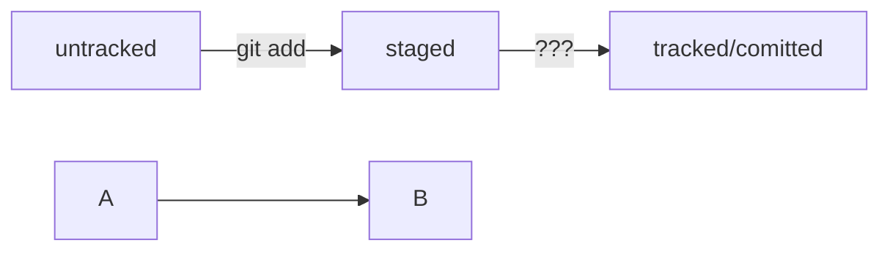

# base git Commands

git config --global  
git init - инициализация репа  
git rm -rf .git - удалить папку с репозиторием  
git status - гит статус  
git status --ignored  -гит статус + игнорируемые файлы  
git add ${file} - отслеживать ${file}  
git add --all - отслеживать состояние всех файлов в папке  
git add . - добавить текующую папку для отслеживания ( все файлы в папке, автоматом будут добавлены)   
git commit -m   - добавить коммит  
git log   - просмотреть историю коммитов  
git remote add origin {url репа} - добавить удалённый репозиторий в локальный   
git remote -v   - Показывает связанные удалённые репозитрии   
git push -u origin master                 Флаг -u(связывает локальную ветку с одноименной удалённой, надо юзать при первом связывании локального и удалённого)   
git commit --amend -m   - изменить сообщение последнего коммита (head)   
git commit --amend --no-edit - добавить новый файл в коммит  
git restore --staged <file>  - убрать файл из стейдж  
git restore --staged . - убрать все файлы папки из стейдж  
git reset --hard <hash> - откатиться до <hash> коммита ( все коммиты идущие перед ним будут стёрты, он станет head)  
git restore <file> - откатить изменения, которые не попали ни в стейдж ни в коммит(файлы модифайд)  
git diff - Эта команда сравнит последнюю закоммиченную версию файла  с текущей (модифайд) версией. (по умолчанию команда git diff не показывает изменения в staged-файлах — только в modified.
Чтобы всё-таки просмотреть изменения в staged, нужно использовать флаг --staged: git diff --staged. )   
git clone <url реппозитория> - Она создаст копию удалённого репозитория на вашем компьютере   
Команда git clone автоматически связывает локальный и удалённый репозиторий.   
То есть если в GitHub-репозитории что-то поменяется (например, добавятся коммиты), вам не нужно будет заново клонировать его.  
Достаточно будет выполнить команду, которая обновит вашу копию.  
git branch - просмотреть ветки проекта  
git branch <название_ветки> - добавить ветку  
git checkout <название_ветки> - переключиться на другую ветку  
git checkout -b <название_ветки> - создать ветку и сразу переключиться на неё  
git diff <название_ветки1> <название_ветки2> - сравнить две ветки  

     
## .gitignore 
Если строка начинается с #, то это комментарий, и .gitignore не будет его учитывать.
вот так можно писать комментарии;  
<file>  - git будет игноривать абсолютно все файлы с именем <file>  
Символ звёздочки (*) соответствует любой строке, включая пустую. Если такой символ используется в шаблоне в .gitignore, значит, файл будет проигнорирован вне зависимости от того, что будет на месте звёздочки.  
игнорировать все файлы, которые заканчиваются на .jpeg  
*.jpeg
Косая черта, или слеш (/), указывает на каталоги. Если шаблон в .gitignore начинается со слеша, то Git проигнорирует файлы или каталоги только в корневой директории.  
игнорировать todo.txt в корне репозитория  
/todo.txt  
!<file> - не игнорировать файлы с названием <file>  
     
##Fork 
«Форк» создаёт копию репозитория в аккаунте GitHub. Такая копия будет полностью независима. Изменения, которые вы внесёте, не будут синхронизированы с исходным репозиторием.  
В процессе «форка» создаётся копия всех файлов, истории коммитов и веток. Эта копия сохраняется в вашей учётной записи GitHub.  

