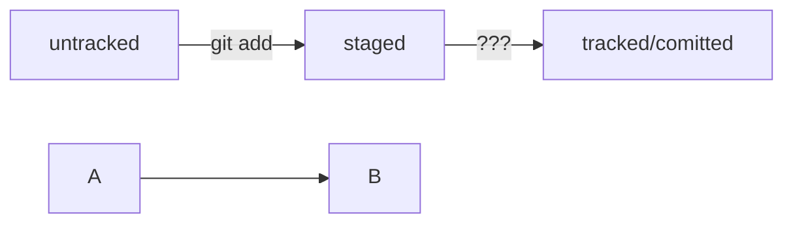

# base git Commands

git config --global  
git init - инициализация репа  
git rm -rf .git - удалить папку с репозиторием  
git status - гит статус  
git add ${file} - отслеживать ${file}  
git add --all - отслеживать состояние всех файлов в папке  
git add . - добавить текующую папку для отслеживания ( все файлы в папке, автоматом будут добавлены)   
git commit -m   - добавить коммит  
git log   - просмотреть историю коммитов  
git remote add origin {url репа} - добавить удалённый репозиторий в локальный   
git remote -v   - Показывает связанные удалённые репозитрии   
git push -u origin master                 Флаг -u(связывает локальную ветку с одноименной удалённой, надо юзать при первом связывании локального и удалённого)   

