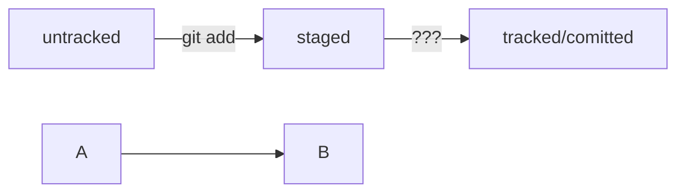

# base git Commands

git config --global  
git init - инициализация репа  
git rm -rf .git - удалить папку с репозиторием  
git status - гит статус  
git add ${file} - отслеживать ${file}  
git add --all - отслеживать состояние всех файлов в папке  
git add . - добавить текующую папку для отслеживания ( все файлы в папке, автоматом будут добавлены)   
git commit -m   - добавить коммит  
git log   - просмотреть историю коммитов  
git remote add origin {url репа} - добавить удалённый репозиторий в локальный   
git remote -v   - Показывает связанные удалённые репозитрии   
git push -u origin master                 Флаг -u(связывает локальную ветку с одноименной удалённой, надо юзать при первом связывании локального и удалённого)   
git commit --amend -m   - изменить сообщение последнего коммита (head)   
git commit --amend --no-edit - добавить новый файл в коммит  
git restore --staged <file>  - убрать файл из стейдж  
git restore --staged . - убрать все файлы папки из стейдж  
git reset --hard <hash> - откатиться до <hash> коммита ( все коммиты идущие перед ним будут стёрты, он станет head)  
git restore <file> - откатить изменения, которые не попали ни в стейдж ни в коммит(файлы модифайд)  
git diff - Эта команда сравнит последнюю закоммиченную версию файла  с текущей (модифайд) версией. (по умолчанию команда git diff не показывает изменения в staged-файлах — только в modified.
Чтобы всё-таки просмотреть изменения в staged, нужно использовать флаг --staged: git diff --staged. )  

