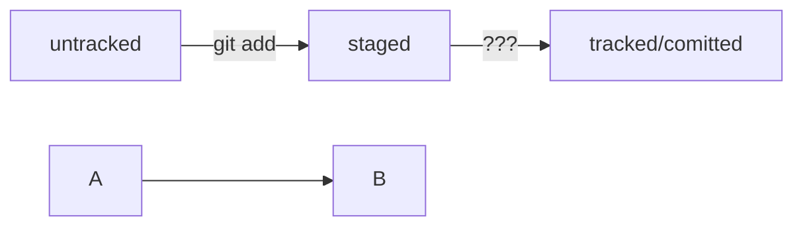

# base git Commands

git config --global  
git init - инициализация репа  
git rm -rf .git - удалить папку с репозиторием  
git status - гит статус  
git status --ignored  -гит статус + игнорируемые файлы  
git add ${file} - отслеживать ${file}  
git add --all - отслеживать состояние всех файлов в папке  
git add . - добавить текующую папку для отслеживания ( все файлы в папке, автоматом будут добавлены)   
git commit -m   - добавить коммит  
git log   - просмотреть историю коммитов  
git remote add origin {url репа} - добавить удалённый репозиторий в локальный   
git remote -v   - Показывает связанные удалённые репозитрии   
git push -u origin master                 Флаг -u(связывает локальную ветку с одноименной удалённой, надо юзать при первом связывании локального и удалённого)   
git commit --amend -m   - изменить сообщение последнего коммита (head)   
git commit --amend --no-edit - добавить новый файл в коммит  
git restore --staged <file>  - убрать файл из стейдж  
git restore --staged . - убрать все файлы папки из стейдж  
git reset --hard <hash> - откатиться до <hash> коммита ( все коммиты идущие перед ним будут стёрты, он станет head)  
git restore <file> - откатить изменения, которые не попали ни в стейдж ни в коммит(файлы модифайд)  
git diff - Эта команда сравнит последнюю закоммиченную версию файла  с текущей (модифайд) версией. (по умолчанию команда git diff не показывает изменения в staged-файлах — только в modified.
Чтобы всё-таки просмотреть изменения в staged, нужно использовать флаг --staged: git diff --staged. )   
git clone <url реппозитория> - Она создаст копию удалённого репозитория на вашем компьютере   
Команда git clone автоматически связывает локальный и удалённый репозиторий.   
То есть если в GitHub-репозитории что-то поменяется (например, добавятся коммиты), вам не нужно будет заново клонировать его.  
Достаточно будет выполнить команду, которая обновит вашу копию.  
git branch - просмотреть ветки проекта  
git branch <название_ветки> - добавить ветку  
git checkout <название_ветки> - переключиться на другую ветку  
git checkout -b <название_ветки> - создать ветку и сразу переключиться на неё  
git diff <название_ветки1> <название_ветки2> - сравнить две ветки  
git merge <название векти> - слияние веток  
git branch -D <название ветки> - удалить ветку(поглащаемую)  Удаление локальной ветки через Git не удаляет ветку на GitHub!   
git pull - Забрать изменения из удалённого репозитория  

     
## .gitignore 
Если строка начинается с #, то это комментарий, и .gitignore не будет его учитывать.
вот так можно писать комментарии;  
<file>  - git будет игноривать абсолютно все файлы с именем <file>  
Символ звёздочки (*) соответствует любой строке, включая пустую. Если такой символ используется в шаблоне в .gitignore, значит, файл будет проигнорирован вне зависимости от того, что будет на месте звёздочки.  
игнорировать все файлы, которые заканчиваются на .jpeg  
*.jpeg
Косая черта, или слеш (/), указывает на каталоги. Если шаблон в .gitignore начинается со слеша, то Git проигнорирует файлы или каталоги только в корневой директории.  
игнорировать todo.txt в корне репозитория  
/todo.txt  
!<file> - не игнорировать файлы с названием <file>  
     
##Fork 
«Форк» создаёт копию репозитория в аккаунте GitHub. Такая копия будет полностью независима. Изменения, которые вы внесёте, не будут синхронизированы с исходным репозиторием.  
В процессе «форка» создаётся копия всех файлов, истории коммитов и веток. Эта копия сохраняется в вашей учётной записи GitHub.      

##Пулл реквест
Пул-реквест — это запрос на рассмотрение предлагаемых изменений и часть процесса ревью.  
Запрос на изменения можно инициировать двумя способами: через ссылку, которую Git выводит после создания ветки, или через интерфейс GitHub.  
После создания пул-реквеста ваши коллеги сделают ревью — оценят предложенные вами правки и оставят свои комментарии.  
По результатам ревью ваши правки могут быть приняты в основную ветку проекта или возвращены на доработку.   

##Подробное описание git 

Обычно git pull — это первая команда, которую вводит разработчик, как только открывает код проекта, чтобы начать с ним работать.  
Дополнительно git pull и git merge выполняют перед тем, как создать пул-реквест.  
При командной работе, особенно в больших командах, основная ветка часто успевает «убежать» вперёд, пока вы подготавливаете свои изменения.  
Поэтому перед созданием пул-реквеста рекомендуется сначала подтянуть изменения из основной ветки, объединить их с вашей, решить все возможные конфликты и лишь затем сделать push. 

$ git checkout main # перешли в main  
$ git pull # подтянули новые изменения в main  
$ git checkout my-branch # вернулись в рабочую ветку my-branch  
$ git merge main # влили main в новую ветку my-branch  
$ git push -u origin my-branch # отправили ветку my-branch в удалённый репозиторий   
 

##Работа с удалённым репозиторием шпаргалки
git push -u origin my-branch (от англ. push, «толкнуть», «протолкнуть») — отправь новую ветку my-branch в удалённый репозиторий и свяжи локальную ветку с удалённой,   
чтобы при дополнительных коммитах можно было писать просто git push без -u;  
git push my-branch — отправь дополнительные изменения в ветку my-branch, которая уже существует в удалённом репозитории;  

##Алгоритм-шпаргалка для создания PR  

Склонировать репозиторий.  
Если вы не участник проекта, предварительно сделать «форк» исходного репозитория.  
На странице репозитория или «форка» нажать кнопки: Code → SSH → скопировать ссылку.  
Выполнить команду git clone <ссылка на репозиторий>.  
Создать ветку для вашей задачи: git checkout -b my-task-branch-name.  
Добавить и «закоммитить» изменения, которые вы хотите внести в проект.  
«Запушить» ветку: git push --set-upstream origin HEAD или git push -u origin my-task-branch-name.  
GitHub (с помощью Git) выведет ссылку на создание PR. По ней нужно перейти.  
PR можно также создать через интерфейс GitHub.  
Сообщить о пул-реквесте ревьюеру.  
Иногда ревьюеры назначаются автоматически, тогда сообщать не нужно.  
Обсуждать с ревьюером предлагаемые изменения и вносить правки, пока эти изменения не будут одобрены (пока не будет получен «апрув»).   
6.1. Если кто-то добавил конфликтующие изменения в main, пока ваш PR был на ревью, нужно разрешить конфликт:   
Обновить main: git checkout main && git pull.  
Влить main в свою ветку: git checkout my-task-branch-name && git merge main.  
Разрешить конфликты слияния с помощью IDE или вручную.  
Создать коммит слияния: git commit --no-edit или git commit -m 'merge main'.  
Сделать git push своей ветки.  
Нажать кнопку Merge или подождать, пока её нажмёт кто-то ещё.   
Ещё раз обновить main, чтобы «подтянуть» ваши изменения в основную ветку локального репозитория: git checkout main && git pull.  
Вы великолепны! Можете начинать снова со второго пункта.  

##Алгоритм-шпаргалка для разрешения конфликтов слияния  

Открыть проект в IDE (VS Code, IDEA или другие).  
Открыть файл, в котором есть конфликт.  
Выбрать, какие части файла нужно взять из одной ветки, а какие — из другой.  
Когда конфликты разрешены, сделать коммит: git commit --no-edit или git commit -m 'merge branch <название ветки>'.  

=

